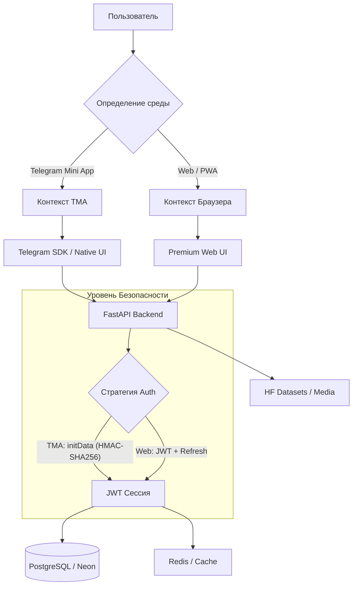

# 🌹 BlackRose: Ультимативная Гибридная Платформа Знаний

[](https://blackrosesl.me)
[](https://huggingface.co/spaces/Nihronick/blackrose-backend)
[](LICENSE)
[](https://www.python.org/)
[](https://fastapi.tiangolo.com/)
[](https://reactjs.org/)

**BlackRose** — это высокопроизводительная и защищенная база знаний для экосистемы **Slayer Legend**, построенная на архитектуре **Ultimate Hybrid Core**. Проект разработан русским разработчиком и полностью оптимизирован для работы в качестве **Telegram Mini App (TMA)** и современного **PWA**, обеспечивая мгновенный доступ к игровым гайдам с премиальным уровнем UX.

---

## ✨ Основные особенности

*   **Premium UI/UX ("Renaissance")**: Интерфейс с использованием Mesh-градиентов, эффекта стекла (Glassmorphism) и плавных анимаций на базе Framer Motion.
*   **Оптимизация под TMA**: Полная интеграция с Telegram SDK, поддержка нативных кнопок, тактильной отдачи (Haptic Feedback) и автоматическое определение платформы.
*   **Умная Синхронизация**: Автоматический импорт, синтез и перевод гайдов из Discord-лаборатории с сохранением игрового глоссария.
*   **Predictive Performance**: Упреждающая загрузка контента (prefetching) и продвинутое кэширование для работы в условиях медленного интернета.

---

## 🏗️ Техническая Архитектура (Hybrid Core)

BlackRose использует уникальную гибридную архитектуру, которая адаптируется под контекст пользователя (TMA vs Web).



---

## 🔐 Безопасность и Надежность

Проект прошел глубокую закалку (hardening) для стабильной работы:
- **Криптографическая валидация**: Проверка `initData` по официальному алгоритму Telegram (HMAC-SHA256).
- **Защита от атак**: Rate Limiting с поддержкой прокси (Hugging Face / Cloudflare) через `X-Forwarded-For`.
- **Мониторинг**: Интеграция с Telegram для мгновенных алертов о критических ошибках бэкенда.
- **Чистая архитектура**: Децентрализованная обработка медиа и автоматическая очистка временных файлов.

---

## 🚀 Быстрый запуск (Локальная разработка)

### 1. Требования
- Docker и Docker Compose
- Node.js 18+ (для фронтенда)

### 2. Настройка окружения
```bash
cp .env.example .env
# Отредактируйте .env, добавив ваш BOT_TOKEN и другие ключи
```

### 3. Запуск Бэкенда (с БД и Redis)
```bash
docker-compose up --build
```
API будет доступно по адресу `http://localhost:8000`.

### 4. Запуск Фронтенда
```bash
cd frontend
npm install
npm run dev
```
Интерфейс будет доступен по адресу `http://localhost:5173`.

---

## 🛠️ Стек Технологий

- **Бэкенд**: FastAPI (Python 3.11+), SQLAlchemy 2.0, Alembic, Pydantic v2, ARQ (для фоновых задач).
- **Фронтенд**: React 18, Vite, Tailwind CSS 4, Framer Motion, TanStack Query.
- **Инфраструктура**: PostgreSQL (Neon.tech), Redis, Docker, GitHub Actions.

---

## 👤 Автор

**Максим Морозов (Nihronick)**
- **GitHub**: [@Nihronick](https://github.com/Nihronick)
- **Статус**: Production Ready | SEO Optimized | Hybrid Core Enabled

---
*BlackRose — это доказательство того, что профессиональный софт можно строить на современных инструментах с креативным подходом к инфраструктуре. Сделано с ❤️ в России.*
