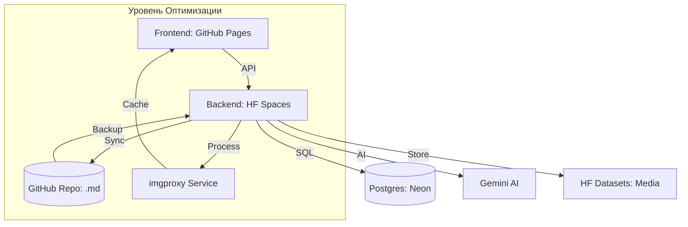

# 🌹 BlackRose: Ультимативная Гибридная Платформа Знаний

[](https://blackrosesl.me)
[](https://huggingface.co/spaces/Nihronick/blackrose-backend)
[](LICENSE)

**BlackRose** — это высокопроизводительная база знаний для экосистемы **Slayer Legend**, построенная на архитектуре **Ultimate Hybrid Core**. Проект объединяет мощь ИИ-синтеза, распределенную инфраструктуру и премиальный UX для создания лучшего опыта чтения гайдов в Telegram и Web.

---

## ✨ Основные особенности

*   **Premium UX ("Renaissance")**: Интерфейс с эффектом стекла (Glassmorphism), Mesh-градиентами и плавными анимациями на базе Framer Motion.
*   **AI Guide Synthesis**: Автоматический импорт контента из Discord-лабораторий с использованием **Gemini 1.5 Flash** для структурирования и перевода.
*   **Media Optimization (imgproxy)**: На лету сжимает и конвертирует скриншоты в WebP, обеспечивая мгновенную загрузку даже при слабом 4G/LTE.
*   **Git-Sync Wiki**: Двусторонняя связь между базой данных и GitHub. Все гайды автоматически бэкапятся в `.md` файлы для версионности.
*   **Haptic & Native Integration**: Глубокая поддержка Telegram SDK (Haptic Feedback, Native Buttons, Theme Sync).

---

## 🏗️ Техническая Архитектура (Hybrid Core)

BlackRose распределен по нескольким облачным слоям для максимальной надежности и бесплатного масштабирования.



---

## 🔐 Настройка окружения (Secrets)

Для полной функциональности в Hugging Face Spaces или локально в `.env` должны быть установлены:

| Variable | Description |
|---|---|
| `BOT_TOKEN` | Telegram Bot API токен |
| `DATABASE_URL` | Ссылка на Postgres (Neon) |
| `HF_TOKEN` | Доступ к Hugging Face Datasets |
| `GEMINI_API_KEY` | Для работы AI-синтезатора |
| `IMGPROXY_URL` | Адрес вашего сервера imgproxy |
| `GITHUB_TOKEN` | Для работы Git-Sync (Wiki бэкап) |

---

## 🛠️ Стек Технологий

- **Бэкенд**: FastAPI, SQLAlchemy 2.0 (Async), Inngest (Workflows), aiogram 3.
- **Фронтенд**: React 18, Vite, Tailwind CSS 4, Framer Motion, Zustand.
- **Инфраструктура**: Neon PostgreSQL, imgproxy (Docker), GitHub API.
- **AI**: Google Gemini 1.5 Flash.

---

## 🚀 Развертывание

Проект использует изолированную стратегию деплоя через скрипты в папке `tools/`:

- `powershell -File tools/deploy-backend.ps1` — Деплой бэкенда на HF Spaces.
- `powershell -File tools/deploy-frontend.ps1` — Сборка и деплой на GitHub Pages.
- `powershell -File tools/architectural_purge.ps1` — Очистка проекта от мусора.

---

## 👤 Автор

**Максим Морозов (Nihronick)**
- **GitHub**: [@Nihronick](https://github.com/Nihronick)
- **Статус**: Production Ready | Media Optimized | AI Powered

---
*BlackRose — сделано с ❤️ в России для глобального комьюнити.*
стка временных файлов.

---

## 🚀 Быстрый запуск (Локальная разработка)

### 1. Требования
- Docker и Docker Compose
- Node.js 18+ (для фронтенда)

### 2. Настройка окружения
```bash
cp .env.example .env
# Отредактируйте .env, добавив ваш BOT_TOKEN и другие ключи
```

### 3. Запуск Бэкенда (с БД и Redis)
```bash
docker-compose up --build
```
API будет доступно по адресу `http://localhost:8000`.

### 4. Запуск Фронтенда
```bash
cd frontend
npm install
npm run dev
```
Интерфейс будет доступен по адресу `http://localhost:5173`.

---

## 🛠️ Стек Технологий

- **Бэкенд**: FastAPI (Python 3.11+), SQLAlchemy 2.0, Alembic, Pydantic v2, ARQ (для фоновых задач).
- **Фронтенд**: React 18, Vite, Tailwind CSS 4, Framer Motion, TanStack Query.
- **Инфраструктура**: PostgreSQL (Neon.tech), Redis, Docker, GitHub Actions.

---

## 👤 Автор

**Максим Морозов (Nihronick)**
- **GitHub**: [@Nihronick](https://github.com/Nihronick)
- **Статус**: Production Ready | SEO Optimized | Hybrid Core Enabled

---
*BlackRose — это доказательство того, что профессиональный софт можно строить на современных инструментах с креативным подходом к инфраструктуре. Сделано с ❤️ в России.*
