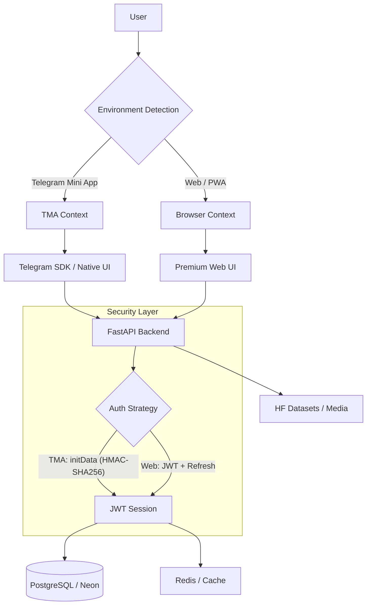

# 🌹 BlackRose: Ultimate Hybrid Core Guide Platform

[](https://blackrosesl.me)
[](https://huggingface.co/spaces/Nihronick/blackrose-backend)
[](LICENSE)
[](https://www.python.org/)
[](https://fastapi.tiangolo.com/)
[](https://reactjs.org/)

**BlackRose** — это высокопроизводительная, защищенная база знаний для экосистемы **Slayer Legend**, реализованная как **Ultimate Hybrid Core**. Проект оптимизирован для работы в качестве **Telegram Mini App (TMA)** и современного **PWA**, обеспечивая бесшовный опыт и мгновенный доступ к гайдам.

---

## 🚀 Quick Start (Local Development)

### 1. Prerequisites
- Docker & Docker Compose
- Node.js 18+ (for frontend)

### 2. Setup Environment
```bash
cp .env.example .env
# Edit .env with your BOT_TOKEN and other credentials
```

### 3. Run Backend (with DB & Redis)
```bash
docker-compose up --build
```
Backend will be available at `http://localhost:8000`.

### 4. Run Frontend
```bash
cd frontend
npm install
npm run dev
```
Frontend will be available at `http://localhost:5173`.

---

## 🏗️ Technical Architecture (Hybrid Core)

## 🏗️ Technical Architecture (Hybrid Core)

BlackRose использует уникальную гибридную архитектуру, которая адаптируется под контекст пользователя (TMA vs Web).



---

## 🔐 Security & Reliability

Проект прошел глубокую закалку (hardening) для работы в продакшене:
- **Криптографическая валидация**: Полная проверка `initData` по официальному алгоритму Telegram.
- **Rate Limiting**: Защита от brute-force с поддержкой прокси (Hugging Face / Cloudflare) через `X-Forwarded-For`.
- **Structured Logging**: Логирование в формате JSON с контекстом (Request ID, User ID, IP).
- **Telegram Alerts**: Мгновенные уведомления администраторов о критических ошибках бэкенда.
- **Deep Health-Check**: Мониторинг здоровья системы с проверкой связности БД и кэша.

---

## 🚀 Key Technical Features

1.  **Environment Awareness (`useAppEnv`)**: Глубокая детекция платформы, автоматическое управление нативной кнопкой "Назад" и цветовыми схемами Telegram.
2.  **Premium UX**:
    - **Skeleton Screens**: Анимированные заглушки для контента и изображений.
    - **Haptic Feedback**: Тактильный отклик (Taptic Engine) при взаимодействии.
    - **Pull-to-Refresh**: Кастомная реализация для мобильных устройств.
3.  **Performance Optimization**:
    - **Code Splitting**: Ленивая загрузка всех вьюх и тяжелых компонентов.
    - **Stale-While-Revalidate**: Продвинутая стратегия кэширования в Service Worker.
    - **Image Lazy Loading**: Оптимизированная загрузка медиа с поддержкой плейсхолдеров.

---

## 📂 Project Structure

- `/backend`: FastAPI (Python 3.11+), SQLAlchemy 2.0, Pydantic v2.
- `/frontend`: React 18 (Vite), Tailwind CSS 4, Framer Motion.
- `/scripts`: Автоматизация деплоя (Hugging Face / GitHub Pages).
3.  **Glossary-Aware Translation:** A custom translation pipeline that respects game-specific terminology.
4.  **Mobile-First UX:** Tailored specifically for the Telegram Mini App environment with native-feeling interactions.

---

## 🛡️ System Status & Reliability

BlackRose is designed for high availability within the constraints of free-tier hosting:
- **Hosting:** Hugging Face Spaces (Backend) & GitHub Pages (Frontend).
- **Storage:** Neon.tech Serverless PostgreSQL.
- **Monitoring:** Integrated Telegram Error Alerts & Structured Logging.

> [!IMPORTANT]
> Since we use free-tier resources, some limitations apply (e.g., ephemeral storage, cold starts). For a detailed analysis of operational risks and our mitigation plans, please refer to [docs/RISKS.md](./docs/RISKS.md).

---

## 🛠️ Development & Deployment

We welcome contributions from the community! Whether it's a bug report, a new feature, or a translation improvement, please check our [CONTRIBUTING.md](./CONTRIBUTING.md) to get started.

## 👤 Author

**Maksim Morozov (Nihronick)**
- **GitHub:** [@Nihronick](https://github.com/Nihronick)
- **Status:** Production Hardened | Hybrid Persistence Enabled | SEO Optimized

---
*BlackRose — это доказательство того, что профессиональный софт можно строить на современных инструментах с креативным подходом к инфраструктуре.*
