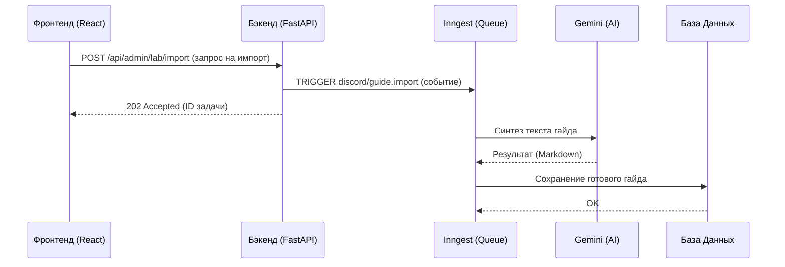

# 🏛️ Логическая Архитектура BlackRose

Этот документ описывает связи между **Фронтендом (React)** и **Бэкендом (FastAPI)** для обеспечения целостности системы.

### 🔍 Потоки данных: Поиск и Главная панель

### 📂 Сопоставление файлов (Логика -> Код)

| Функционал | Компонент Фронтенда | Роутер Бэкенда | Таблица БД |
|---|---|---|---|
| **Главный экран** | `HomeDashboard.tsx` | `public.py` | `guides`, `comments` |
| **История поиска** | `useSearchHistory.ts` | (Клиентская часть / CloudStorage) | - |
| **Гайды и Контент** | `GuideView.tsx` | `public.py` | `guides`, `guide_tags` |
| **Управление Медиа** | `ExportImport.tsx` | `admin.py` | (Hugging Face API) |
| **Авторизация** | `AdminLoginModal.tsx` | `core/auth.py` | `local_admins`, `members` |

---

### 🏛️ Правила Разработки (MANDATORY)

1.  **Flat Imports**: Бэкенд использует плоскую структуру. Все импорты должны идти от корня `/app`. **Запрещено** использовать префикс `backend.` (например, `from api import ...` вместо `from backend.api import ...`).
2.  **Package Markers**: Каждая подпапка в `backend/` должна содержать `__init__.py`. Это критично для корректной работы Docker и CI.
3.  **Inngest SDK**: При интеграции с FastAPI используйте `import inngest.fast_api` (с подчеркиванием).

## 📦 Архитектура потоков данных

1.  **Запрос (Request)**: React-приложение использует `TanStack Query` для асинхронных вызовов к FastAPI.
2.  **Обработка (Logic)**: Бэкенд проверяет JWT/Telegram сессию в `core/auth.py`.
3.  **Данные (Storage)**:
    *   **SQL**: PostgreSQL (Neon) для гайдов, комментариев и истории.
    *   **Knowledge**: `core/glossary.json` для AI-синтеза.
    *   **Media**: Hugging Face Datasets + `imgproxy` для оптимизации.
    *   **Persistence**: `GitSyncService` автоматически бэкапит контент базы в `.md` файлы на GitHub.
4.  **Наблюдаемость (Observability)**:
    *   **Logs**: `structlog` с ротацией логов.
    *   **Jobs**: Inngest для управления сложными фоновыми задачами.
