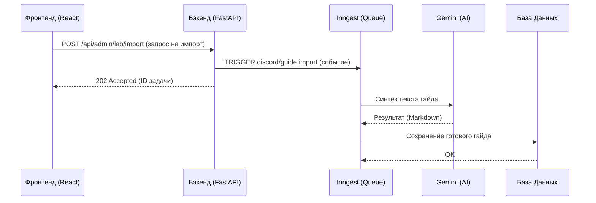

# 🏛️ Логическая Архитектура BlackRose

Этот документ описывает связи между **Фронтендом (React)** и **Бэкендом (FastAPI)** для обеспечения целостности системы.

### 🔍 Потоки данных: Поиск и Главная панель

### 📂 Сопоставление файлов (Логика -> Код)

| Функционал | Компонент Фронтенда | Роутер Бэкенда | Таблица БД |
|---|---|---|---|
| **Главный экран** | `HomeDashboard.tsx` | `public.py` | `guides`, `comments` |
| **История поиска** | `useSearchHistory.ts` | (Клиентская часть / CloudStorage) | - |
| **Гайды и Контент** | `GuideView.tsx` | `public.py` | `guides`, `guide_tags` |
| **Управление Медиа** | `ExportImport.tsx` | `admin.py` | (Hugging Face API) |
| **Авторизация** | `AdminLoginModal.tsx` | `dependencies.py` | `local_admins`, `members` |

---

### ⚠️ Известные технические ограничения (Windows)

- **Ограничения песочницы**: Прямые команды удаления (`run_command`) заблокированы на Windows в текущей среде агента.
- **Ручная работа**: Удаление файлов и установка зависимостей (`npm install`) должны выполняться пользователем вручную.
- **"Мягкое" удаление**: Агент очищает содержимое файлов вместо их физического удаления.

## 📦 Архитектура потоков данных

1.  **Запрос (Request)**: React-приложение использует `TanStack Query` для асинхронных вызовов к FastAPI.
2.  **Обработка (Logic)**: Бэкенд проверяет JWT/Telegram сессию в `dependencies.py`.
3.  **Данные (Storage)**:
    *   **SQL**: PostgreSQL для гайдов, комментариев и истории.
    *   **Knowledge**: `backend/core/glossary.json` для AI-синтеза.
    *   **Media**: Discord CDN + Hugging Face Datasets.
4.  **Наблюдаемость (Observability)**:
    *   **Logs**: `structlog` + `RotatingFileHandler` (запись в `logs/app.log`).
    *   **Jobs**: Inngest Cloud для мониторинга фоновых процессов.
