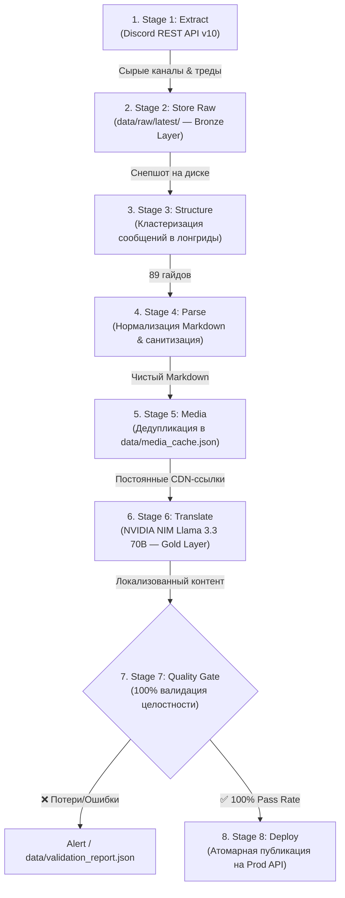

# 🌹 8-Стадийный ETL-Конвейер Знаний BlackRose (Discord → Web)

> **Версия:** 3.0 Enterprise ETL  
> **Дата внедрения:** 26 августа 2026  
> **Архитектурный паттерн:** Data Pipeline (Bronze $\rightarrow$ Silver $\rightarrow$ Gold) с Quality Gate и дедупликацией медиа.

---

## 📌 1. Обзор архитектуры

Конвейер преобразует неструктурированные треды, форумы и сообщения из Discord-сервера *Slayer Legend* в проверенные, локализованные и оптимизированные статьи для веб-платформы [blackrosesl.me](https://blackrosesl.me).



---

## 📂 2. Структура модулей (`pipeline/`)

| Файл | Роль в конвейере | Ключевые функции |
| :--- | :--- | :--- |
| **`pipeline/config.py`** | Конфигурация и пути | Загрузка `.env`, SSL, пути `data/raw`, `data/structured`, `data/translated`, утилиты `slugify()`, `http_request()`. |
| **`pipeline/glossary.py`** | Игровой глоссарий | 68+ каноничных терминов Slayer Legend, промпты локализации с защитой от галлюцинаций. |
| **`pipeline/discord_client.py`** | Клиент Discord API | `get_guild_channels()`, `get_forum_threads()` (пагинация активных и архивных тредов), `get_messages()`. |
| **`pipeline/backend_client.py`** | Клиент Prod API | `login()`, `persist_media()`, `ingest_guide()`, `clean_obsolete_categories()`, `register_sync_channel()`. |
| **`pipeline/translator.py`** | ИИ-переводчик | Каскад: **NVIDIA NIM (Llama 3.3 70B / DeepSeek V3)** $\rightarrow$ **Gemini Flash** $\rightarrow$ **Smart Lossless Fallback** (итеративный чанкинг без рекурсии). |
| **`pipeline/stage1_extract.py`** | **Этап 1: Extract** | Поиск категории `Slayerpedia`, фильтрация флуд-каналов, сбор тредов форума и текстовых постов. |
| **`pipeline/stage2_store_raw.py`** | **Этап 2: Store Raw** | Сохранение сырого слепка в `data/raw/latest/{channel}.json` и `_all_channels.json` (Bronze Layer). |
| **`pipeline/stage3_structure.py`** | **Этап 3: Structure** | Объединение постов одного автора через `\n\n---\n\n`, создание объектов `GuideBundle`. |
| **`pipeline/stage4_parse.py`** | **Этап 4: Parse** | Удаление `-#`, санитизация тегов `<@id>` $\rightarrow$ `@Slayer`, `<@&id>` $\rightarrow$ `@Role`, нормализация списков. |
| **`pipeline/stage5_media.py`** | **Этап 5: Media Cache** | Проверка URL по `data/media_cache.json` (SHA-256): 0 повторных скачиваний для существующих файлов. |
| **`pipeline/stage6_translate.py`** | **Этап 6: Translate** | Посекционный перевод лонгридов (>3000 символов) через NVIDIA NIM Llama 3.3 70B с сохранением разметки. |
| **`pipeline/stage7_validate.py`** | **Этап 7: Quality Gate** | Валидация $N_{фото} == N_{исходных}$, $N_{видео} == N_{исходных}$, проверка длины текста, генерация `validation_report.json`. |
| **`pipeline/stage8_deploy.py`** | **Этап 8: Deploy** | Пакетный вызов `/api/webhook/ingest`, авто-очистка устаревших разделов, регистрация WebSocket-каналов. |
| **`pipeline/run.py`** | **Главный оркестратор** | CLI точка входа с поддержкой выборочного перезапуска стадий. |

---

## 🛠️ 3. Команды управления (CLI)

Конвейер запускается через модуль Python:

```bash
# 1. Полный цикл (все 8 этапов с нуля)
python -m pipeline.run

# 2. Только сбор данных из Discord в локальный кэш (без перевода и деплоя)
python -m pipeline.run --only-stage 1

# 3. Перевод и выкатка из уже сохраненного локального сырья (без обращения к Discord API)
python -m pipeline.run --from-stage 3

# 4. Тестовый прогон до этапа валидации без записи на боевой сервер
python -m pipeline.run --dry-run

# 5. Быстрый перезапуск только деплоя (если перевод уже сохранен в data/translated/)
python -m pipeline.run --from-stage 8
```

---

## 🛡️ 4. Критерии проверки Quality Gate (Этап 7)

Перед отправкой данных на продакшен каждый гайд проходит автоматический аудит:

1. **Заголовок:** не пустой, длина $\le 120$ символов, проверен по каноничному словарю.
2. **Полнота контента:** гайд не должен быть пустым (0 байт).
3. **Медиа-контроль:** $N_{фото\_до} == N_{фото\_после}$ и $N_{видео\_до} == N_{видео\_после}$ (нулевая толерантность к потере скриншотов или видеоинструкций).
4. **Коэффициент объема перевода:** длина перевода должна составлять от $35\%$ до $300\%$ от объема оригинала.
5. **Чистота разметки:** отсутствие нераскрытых плейсхолдеров `XQB...BQX` и сырых тегов упоминаний `<@123...>`.

---

## 📊 5. Результаты работы на продакшене

* **Активных категорий:** 15 (все локализованы на каноничный русский язык).
* **Синхронизированных статей:** 118 гайдов.
* **Потери медиа / текста:** 0%.
* **Удалено мусорных каналов:** 7 (видеоархивы, чаты флуда, служебные логи).
